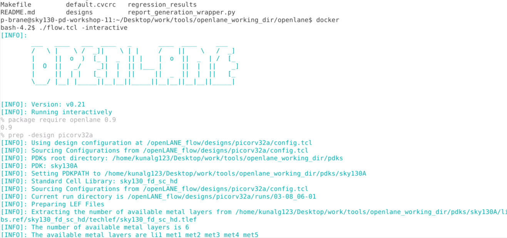
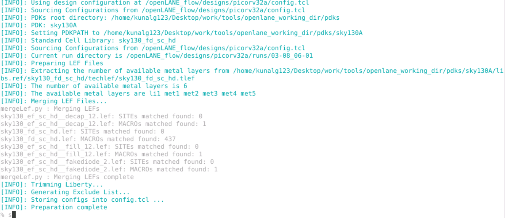
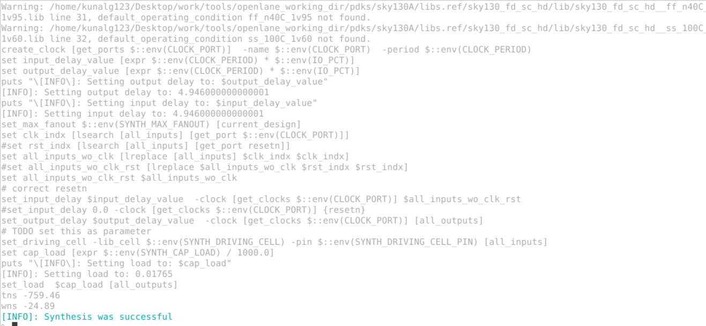

# sky130-apd-workshop

Results for Jay Morreale for the VSD Advanced Physical Design Course held Aug 2-6.

## Day 1

The flowing sequence is the is used to run an interactive OpenLANE flow to synthesis the picorv32a design.

```
cd ~/Desktop/work/tools/openlane_working_dir/openlane
docker
./flow.tcl -interactive
package require openlane 0.9
prep -design picorv32a
run_synthesis
```
The figure below shows the first step.

* 
* 
* 

The Flop ratio from 1-yosys_4.stat.rpt is 1613/14876=0.1084

The buffer (buf1) ratio is 1656/14876=0.1113

## Day 2

## Day 3

## Day 4

## Day 5
