# sky130-apd-workshop

Results for Jay Morreale for the VSD Advanced Physical Design Course held Aug 2-6.

[TOC]

## Day 1

### Start openLANE
The flowing sequence is the is used to run an interactive OpenLANE flow to synthesis the picorv32a design.

```
cd ~/Desktop/work/tools/openlane_working_dir/openlane
docker
./flow.tcl -interactive
package require openlane 0.9
prep -design picorv32a
run_synthesis
```
The figure below shows the first step.

* 
* 

### Synthesis

* 

The Flop ratio from 1-yosys_4.stat.rpt is 1613/14876=0.1084

The buffer (buf1) ratio is 1656/14876=0.1113

## Day 2

### Floorplan Generation
The next step is to create a floorplan for the picorv32a design.

`run_floorplan`

The details of the configuration variable are located in '/home/p-brane/Desktop/work/tools/openlane_working_dir/openlane/configuration/README.md‌‌' under the Floorplanning section. Each variable is shown, defined and a default value is defined. Some of the floorplanning variable are shown in the figure below.


The default values can be change in the floorplan.tcl file. Some of the floorplan.tcl is shown in the figure below.


The floorplan.tch file places the horizontal metal on layer 3 which is metal4 and the vertical metal on layer 4 which is metal5. The metal layer stack is shown in the figure below.


The run_floorplan runs for a while and indicate a successful completion.


The log file ioPlaer.log from the floorplan are found at `/home/p-brane/Desktop/work/tools/openlane_working_dir/openlane/designs/picorv32a/runs/03-08_02-33/logs/floorplan/`


The ioPlacer.log file contains the following info.

```
‌‌OpenROAD 0.9.0 1415572a73
This program is licensed under the BSD-3 license. See the LICENSE file for details.
Components of this program may be licensed under more restrictive licenses which must be honored.
Notice 0: Reading LEF file:  /openLANE_flow/designs/picorv32a/runs/03-08_02-33/tmp/merged.lef
Notice 0:     Created 13 technology layers
Notice 0:     Created 25 technology vias
Notice 0:     Created 440 library cells
Notice 0: Finished LEF file:  /openLANE_flow/designs/picorv32a/runs/03-08_02-33/tmp/merged.lef
Notice 0:
Reading DEF file: /openLANE_flow/designs/picorv32a/runs/03-08_02-33/tmp/floorplan/3-verilog2def_openroad.def
Notice 0: Design: picorv32a
Notice 0:     Created 409 pins.
Notice 0:     Created 14876 components and 115597 component-terminals.
Notice 0:     Created 14978 nets and 56051 connections.
Notice 0: Finished DEF file: /openLANE_flow/designs/picorv32a/runs/03-08_02-33/tmp/floorplan/3-verilog2def_openroad.def
#Macro blocks found: 0
Using 5u default boundaries offset
Random pin placement
RandomMode Even
```

The default config.tcl and default sky130A_sky130_fd_sc_hd_config.tcl file were used for this floorplan run. The configuration files are located at `/home/p-brane/Desktop/work/tools/openlane_working_dir/openlane/designs/picorv32a/`


The picov32a.def file contains the floorplan results and is located at `/home/p-brane/Desktop/work/tools/openlane_working_dir/openlane/designs/picorv32a/runs/03-08_06-01/results/floorplan/`. The total die area is 660685 by 671405 units and can be converter to microns by dividing 1000 (1 micron = 1000 units).


### Floorplan Layout with Magic

Magic will display the floorplan layout graphically. Magic is invoked as using the following command in a new terminal.

`magic -T /home/p-brane/Desktop/work/tools/openlane_working_dir/pdks/sky130A/libs.tech/magic/sky130A.tech lef read /home/p-brane/Desktop/work/tools/openlane_working_dir/openlane/designs/picorv32a/runs/03-08_06-01/tmp/merged.lef def read /home/p-brane/Desktop/work/tools/openlane_working_dir/openlane/designs/picorv32a/runs/03-08_06-01/results/floorplan/picov32a.floorplan.def &`

The sky130A.tech file describes the Skywater 130 nm process and the picov32a.floorplan.def file contain the floorplan for the picorv32a design generated by the run_floorplan script.


The Layout appears.


To zoom, left mouse click and then right mouse click to form a rectangle and press `z` to zoom. Hover over a cell and press 's' to select and the tkcon window will show the status of the cell. The standard cells are located in the lower left corner.


An error occurred so run_synthesis and run_placement error run again.


The magic command becomes

`magic -T /home/p-brane/Desktop/work/tools/openlane_working_dir/pdks/sky130A/libs.tech/magic/sky130A.tech lef read /home/p-brane/Desktop/work/tools/openlane_working_dir/openlane/designs/picorv32a/runs/04-08_06-57/tmp/merged.lef def read /home/p-brane/Desktop/work/tools/openlane_working_dir/openlane/designs/picorv32a/runs/04-08_06-57j/results/floorplan/picorv32a.floorplan.def &`

Magic now shows the status of the standard cells, there may still be an error.


### Placement

To place the standard cells run 'run_placement'.


## Day 3

### CMOS Inverter Standard Cell

Download the vsdstdcelldesign from GitHub to the openlane directory. This can be accomplished using the following commands

`cd /home/Desktop/work/tools/openlane_working_dir/openlane`
`git clone https://github.com/nickson-jose/vsdstdcelldesign.git`


Move into the vsdstdcelldesign directory and copy the sky130A.tech file to the vsdstdcelldesign directory

`cd vsdstdcelldesign`
`cp /home/Desktop/work/tools/openlane_working_dir/pdks/sky130A/libs.tech/magic/sly130A.tech  .`


### Inverter Layout in Magic

Run magic using `magic -d XR -T sky130A.tech sky130_inv.mag&` The -d XR setting use a different graphics system and produces a clearer window.


### Extracted SPICE Netlist

To extract a spice netlist, then the parasitic capacitance and resistance.

```
extract all
ext2spice cthresh 0 rthresh 0
ext2spice
```


This generates teh sky130_inv.ext and sky130_inv.spice files.


sky130_inv.ext file
```
timestamp 1600540370
version 8.3
tech sky130A
style ngspice()
scale 1000 1 1e+06
resistclasses 2200000 3050000 1700000 3050000 120000 197000 114000 191000 120000 197000 114000 191000 48200 319800 2000000 48200 48200 12200 125 125 47 47 29 5
parameters sky130_fd_pr__nfet_01v8 l=l w=w a1=as p1=ps a2=ad p2=pd
parameters sky130_fd_pr__pfet_01v8 l=l w=w a1=as p1=ps a2=ad p2=pd
port "Y" 2 96 121 131 164 li
port "A" 1 10 121 45 164 li
port "VPWR" 3 44 258 90 289 m1
port "VGND" 5 50 -3 105 26 m1
node "Y" 474 347.122 96 121 li 0 0 0 0 0 0 0 0 1435 152 1443 152 0 0 0 0 0 0 0 0 0 0 0 0 0 0 0 0 0 0 0 0 0 0 5951 544 0 0 0 0 0 0 0 0 0 0 0 0
node "A" 462 409.094 10 121 li 0 0 0 0 0 0 0 0 0 0 0 0 0 0 0 0 0 0 0 0 0 0 0 0 0 0 0 0 0 0 7322 578 0 0 2295 192 0 0 0 0 0 0 0 0 0 0 0 0
node "VPWR" 2717 828.259 44 258 m1 0 0 0 0 33630 734 0 0 2950 286 1517 156 0 0 0 0 0 0 0 0 0 0 0 0 0 0 0 0 0 0 0 0 0 0 6865 546 8496 450 0 0 0 0 0 0 0 0 0 0
substrate "VGND" 0 0 50 -3 m1 0 0 0 0 0 0 0 0 1365 148 2574 278 0 0 0 0 0 0 0 0 0 0 0 0 0 0 0 0 0 0 0 0 0 0 6941 498 8064 432 0 0 0 0 0 0 0 0 0 0
cap "VPWR" "A" 66.0605
cap "VPWR" "Y" 106.092
cap "A" "Y" 45.4865
device msubckt sky130_fd_pr__nfet_01v8 49 41 50 42 l=23 w=35 "VGND" "A" 46 0 "VGND" 35 0 "Y" 35 0
device msubckt sky130_fd_pr__pfet_01v8 49 196 50 197 l=23 w=37 "VPWR" "A" 46 0 "VPWR" 37 0 "Y" 37 0
subcap "Y" -107.681
subcap "A" -45.9469
subcap "VPWR" -243.219
subcap "VGND" -109.355
```
sky130_inv.spice file
```
* SPICE3 file created from sky130_inv.ext - technology: sky130A

.option scale=10000u

.subckt sky130_inv A Y VPWR VGND
X0 Y A VGND VGND sky130_fd_pr__nfet_01v8 ad=0 pd=0 as=0 ps=0 w=35 l=23
X1 Y A VPWR VPWR sky130_fd_pr__pfet_01v8 ad=0 pd=0 as=0 ps=0 w=37 l=23
C0 Y A 0.05fF
C1 VPWR A 0.07fF
C2 Y VPWR 0.11fF
C3 Y VGND 0.24fF
C4 VPWR VGND 0.59fF
.ends
```
### Spice Deck

Update the sky130_inv.spice file to use the correct scaling factor and models. From the tkcon the root cell box is 0.01 x 0.01 microns. The scale is change to `.option scale =0.01u'


Updated SPICE Netlist

```
‌‌* SPICE3 file created from sky130_inv.ext - technology: sky130A

.option scale=0.01u
.include ./libs/nshort.lib
.include ./libs/pshort.lib

//.subckt sky130_inv A Y VPWR VGND
M0 Y A VGND VGND nshort_model.0 ad=0 pd=0 as=0 ps=0 w=35 l=23
M1 Y A VPWR VPWR pshort_model.0 ad=0 pd=0 as=0 ps=0 w=37 l=23
VDD VPWR 0 3.3V
VSS VGND 0 0V
Va A VGND PULSE(0V 3.3V 0 0.1n 0.1n 2ms 4m)
C0 Y A 0.05fF
C1 VPWR A 0.07fF
C2 Y VPWR 0.11fF
C3 Y VGND 0.24fF
C4 VPWR VGND 0.59fF
//.ends
.tran 1n 20m
.control
run
.endc
.end
```
### SPICE Simulation

Simulate the SPICE deck using 'ngspice sky130_inv.spice'


Then plot the results `plot y vs time a`


## Day 4

### Inverter Cell

Go to the vsdstdcelldesign directory at `/home/p-brane/Desktop/work/tools/openlane_working_dir/openlane/vsdstdcelldesign` and run Magic on the for the inverter.

‌`magic -d XR -T sky130A.tech sky130_inv.mag&`


### Check Grid Alignment
The inverter cell is laid out on a grid that must match the pitch and offsets defined in the tracks.info file located at `/home/p-brane/Desktop/work/tools/openlane_working_dir/pdks/sky130A/libs.tech/openlane/sky130_fd_sc_hd/tracks.inf`
The file contains the layer name, X or Y dimension, offset, and pitch as shown below.
```
li1 X 0.23 0.46
li1 Y 0.17 0.34
met1 X 0.17 0.34
met1 Y 0.17 0.34
met2 X 0.23 0.46
met2 Y 0.23 0.46
met3 X 0.34 0.68
met3 Y 0.34 0.68
met4 X 0.46 0.92
met4 Y 0.46 0.92
met5 X 1.70 3.40
met5 Y 1.70 3.40
```
The default grid is 0.01 um x 0.01 um as shown in the tkcon above. It can be changed to match the tracks.info grid for the li (locali) layer. Using `grid 0.46um 0.34ym 0.23um 0.17um`


The alignment of the cell elements with the grid can be verified.


### Assign Ports for LEF File Generation

To create aa lef files the ports of the need to be defined for pins in the lef macro


Define the input port A and set the class to input and use to signal.


Define output port Y and set the class to output and use to signal.


Define VPWR port and set the class to input and use to power.


Define VGND port and set the class to input and use to ground.


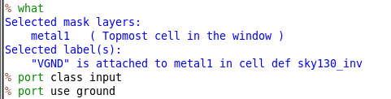

Save the file: `save sky130_jayinv.mag`

Open the new file using `magic -d XR -T sky130A.tech sky130_jayinv.mag&`

### LEF FIle
Use `lef write` to generate a lef file
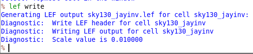

The generated sky130_jayinv.lef file is shown below
```
VERSION 5.7 ;
  NOWIREEXTENSIONATPIN ON ;
  DIVIDERCHAR "/" ;
  BUSBITCHARS "[]" ;
MACRO sky130_jayinv
  CLASS CORE ;
  FOREIGN sky130_jayinv ;
  ORIGIN 0.000 0.000 ;
  SIZE 1.380 BY 2.720 ;
  SITE unithd ;
  PIN A
    DIRECTION INPUT ;
    USE SIGNAL ;
    ANTENNAGATEAREA 0.165600 ;
    PORT
      LAYER li1 ;
        RECT 0.060 1.180 0.510 1.690 ;
    END
  END A
  PIN Y
    DIRECTION OUTPUT ;
    USE SIGNAL ;
    ANTENNADIFFAREA 0.287800 ;
    PORT
      LAYER li1 ;
        RECT 0.760 1.960 1.100 2.330 ;
        RECT 0.880 1.690 1.050 1.960 ;
        RECT 0.880 1.180 1.330 1.690 ;
        RECT 0.880 0.760 1.050 1.180 ;
        RECT 0.780 0.410 1.130 0.760 ;
    END
  END Y
  PIN VPWR
    DIRECTION INPUT ;
    USE POWER ;
    PORT
      LAYER nwell ;
        RECT -0.200 1.140 1.570 3.040 ;
      LAYER li1 ;
        RECT -0.200 2.580 1.430 2.900 ;
        RECT 0.180 2.330 0.350 2.580 ;
        RECT 0.100 1.970 0.440 2.330 ;
      LAYER mcon ;
        RECT 0.230 2.640 0.400 2.810 ;
        RECT 1.000 2.650 1.170 2.820 ;
      LAYER met1 ;
        RECT -0.200 2.480 1.570 2.960 ;
    END
  END VPWR
  PIN VGND
    DIRECTION INPUT ;
    USE GROUND ;
    PORT
      LAYER li1 ;
        RECT 0.100 0.410 0.450 0.760 ;
        RECT 0.150 0.210 0.380 0.410 ;
        RECT 0.000 -0.150 1.460 0.210 ;
      LAYER mcon ;
        RECT 0.210 -0.090 0.380 0.080 ;
        RECT 1.050 -0.090 1.220 0.080 ;
      LAYER met1 ;
        RECT -0.110 -0.240 1.570 0.240 ;
    END
  END VGND
END sky130_jayinv
END LIBRARY
```

### SRC File Setup
Copy the provided `my_base.sdc` file from the `vsdstdcelldesign/extras` and the `sky130_jayinv.lef` to the `picorv32a/src` directory. Copy the `vsdstdcelldesign/extras/sta.conf` file to the openlane directory.

```
cd /home/p-brane/Desktop/work/tools/openlane_working_dir/openlane/vsdstdcelldesign/extras/
cp my_base.sdc /home/p-brane/Desktop/work/tools/openlane_working_dir/openlane/designs/picorv32a/src/
cp sta.conf /home/p-brane/Desktop/work/tools/openlane_working_dir/openlane/
cd /home/p-brane/Desktop/work/tools/openlane_working_dir/openlane/vsdstdcelldesign/
cp sky130_jayinv.lef /home/p-brane/Desktop/work/tools/openlane_working_dir/openlane/designs/picorv32a/src/
```


Copy the sky130 libraries to the picrv32a/src directory

```
cd /home/p-brane/Desktop/work/tools/openlane_working_dir/openlane/vsdstdcelldesign/libs/
cp sky130_fd_sc_hd__* /home/p-brane/Desktop/work/tools/openlane_working_dir/openlane/designs/picorv32a/src/
```


### Config.tcl

Modify the config.tcl to include the copied libraries at  `/home/p-brane/Desktop/work/tools/openlane_working_dir/openlane/designs/picorv32a/config.tcl`
The modified file is shown below. LIB_MIN was replaced with LIB_FASTEST, and LIB_MAX was replace with LIB_SLOWEST.

```
# Design
set ::env(DESIGN_NAME) "picorv32a"

set ::env(VERILOG_FILES) "./designs/picorv32a/src/picorv32a.v"
set ::env(SDC_FILE) "./designs/picorv32a/src/picorv32a.sdc"

set ::env(CLOCK_PERIOD) "12.000"
set ::env(CLOCK_PORT) "clk"


set ::env(CLOCK_NET) $::env(CLOCK_PORT)

set ::env(LIB_SYNTH) "$::env(OPENLANE_ROOT)/designs/picorv32a/src/sky130_fd_sc_hd__typical.lib"
set ::env(LIB_FASTEST) "$::env(OPENLANE_ROOT)/designs/picorv32a/src/sky130_fd_sc_hd__fast.lib"
set ::env(LIB_SLOWEST) "$::env(OPENLANE_ROOT)/designs/picorv32a/src/sky130_fd_sc_hd__slow.lib"
set ::env(LIB_TYPICAL) "$::env(OPENLANE_ROOT)/designs/picorv32a/src/sky130_fd_sc_hd__typical.lib"

set ::env(EXTRA_LEFS) [glob $::env(OPENLANE_ROOT)/designs/$::env(DESIGN_NAME)/src/*.lef]


set filename $::env(OPENLANE_ROOT)/designs/$::env(DESIGN_NAME)/$::env(PDK)_$::env(STD_CELL_LIBRARY)_config.tcl
if { [file exists $filename] == 1} {
	source $filename
}
```

### pre_sta.conf

The `pre_sta.conf` static timing configuration file must be setup. `cd /home/p-brane/Desktop/work/tools/openlane_working_dir/openlane/` and rename the `sta.conf` file to `pre-sta.conf` using `mv sta.conf pre_sta.conf`. Edit the pre_sta.conf file as shown below to add the links to the libraries and the verilog file.
```
set_cmd_units -time ns -capacitance pF -current mA -voltage V -resistance kOhm -distance um
read_liberty -min /home/p-brane/Desktop/work/tools/openlane_working_dir/openlane/designs/picorv32a/src/sky130_fd_sc_hd__fast.lib
read_liberty -max /home/p-brane/Desktop/work/tools/openlane_working_dir/openlane/designs/picorv32a/src/sky130_fd_sc_hd__slow.lib
read_verilog /home/p-brane/Desktop/work/tools/openlane_working_dir/openlane/designs/picorv32a/runs/04-08_06-57/results/synthesis/picorv32a.synthesis.v
link_design picorv32a
read_sdc /home/p-brane/Desktop/work/tools/openlane_working_dir/openlane/designs/picorv32a/src/my_base.sdc
report_checks -path_delay min_max -fields {slew trans net cap input_pin}
report_tns
report_wns
```
### my_base.sdc

The my-base.sdc file is used to configure variables in the design. The definition and default values are described in the `~/openlane/configuration/README.md` file. The `my_base.sdc` file is use to setup with required variables and other parameters.
```
set ::env(CLOCK_PORT) clk
set ::env(CLOCK_PERIOD) 12.000
set ::env(SYNTH_DRIVING_CELL) sky130_fd_sc_hd__inv_8
set ::env(SYNTH_DRIVING_CELL_PIN) Y
set ::env(SYNTH_CAP_LOAD) 17.65
create_clock [get_ports $::env(CLOCK_PORT)]  -name $::env(CLOCK_PORT)  -period $::env(CLOCK_PERIOD)
set IO_PCT  0.2
set input_delay_value [expr $::env(CLOCK_PERIOD) * $IO_PCT]
set output_delay_value [expr $::env(CLOCK_PERIOD) * $IO_PCT]
puts "\[INFO\]: Setting output delay to: $output_delay_value"
puts "\[INFO\]: Setting input delay to: $input_delay_value"


set clk_indx [lsearch [all_inputs] [get_port $::env(CLOCK_PORT)]]
#set rst_indx [lsearch [all_inputs] [get_port resetn]]
set all_inputs_wo_clk [lreplace [all_inputs] $clk_indx $clk_indx]
#set all_inputs_wo_clk_rst [lreplace $all_inputs_wo_clk $rst_indx $rst_indx]
set all_inputs_wo_clk_rst $all_inputs_wo_clk


# correct resetn
set_input_delay $input_delay_value  -clock [get_clocks $::env(CLOCK_PORT)] $all_inputs_wo_clk_rst
#set_input_delay 0.0 -clock [get_clocks $::env(CLOCK_PORT)] {resetn}
set_output_delay $output_delay_value  -clock [get_clocks $::env(CLOCK_PORT)] [all_outputs]

# TODO set this as parameter
set_driving_cell -lib_cell $::env(SYNTH_DRIVING_CELL) -pin $::env(SYNTH_DRIVING_CELL_PIN) [all_inputs]
set cap_load [expr $::env(SYNTH_CAP_LOAD) / 1000.0]
puts "\[INFO\]: Setting load to: $cap_load"
set_load  $cap_load [all_outputs]
```

### OpenLANE

The files supplied with vsdstdcelldesign name the inverter that we produces sky130_vsdinv in the library. If a different name is used then the sky130_vsd macros in the libraries need to renamed so that the `run_synthesis` tools can find the `sky130_jayinv`.

To use the sky130_jayinv inverter, The libraries `sky130_fd_sc_hd__typical.lib`, `sky130_fd_sc_hd__slow.lib`, and `sky130_fd_sc_hd__fast.lib` in the src folder were modified with the new name `sky130_vsdinv` -> `sky130_jayinv`.

The lectures use `docker run -it -v $(pwd):/openLANE_flow -v $PDK_ROOT:$PDK_ROOT -e PDK_ROOT=$PDK_ROOT -u $(id -u $USER):$(id -g $USER) openlane:rc2` to start docker. I was not able to get this to work properly and find that `docker` seems to work fine. Once `docker` is running then the follow commands can be issued to setup openlane for synthesis.

```
docker
./flow.tcl interactive
package require openlane 0.9
prep -design picorv32a -tag 04-08_06-57 -overwrite
set lefs [glob $::env(DESIGN_DIR)/src/*.lef]
add_lefs -src $lefs
```


### Synthesis

`run_synthesis`produces the following output.

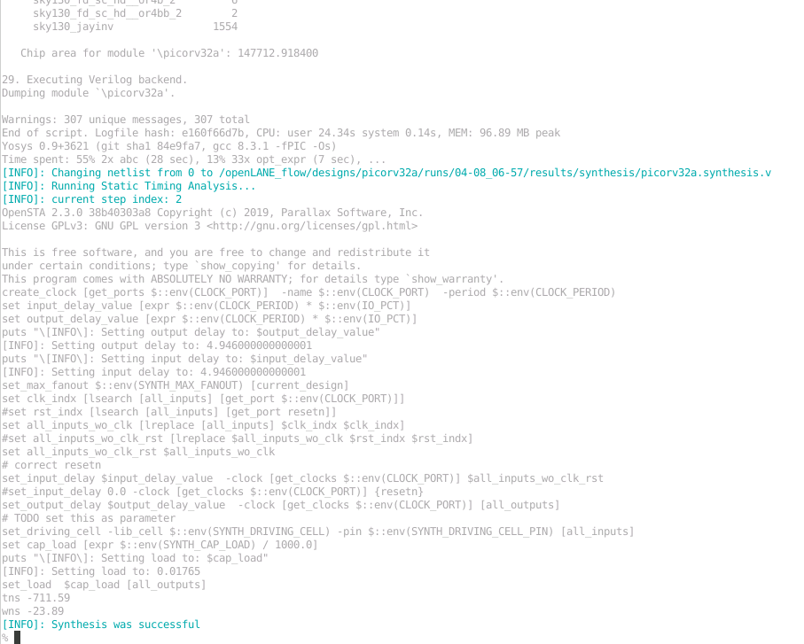

### Static Timing Analysis

Static timing analysis can be performed using `sta pre-sta.conf` from a terminal in the `/home/p-brane/Desktop/work/tools/openlane_working_dir/openlane/` directory. The setup slack violation at this point is -36.62.

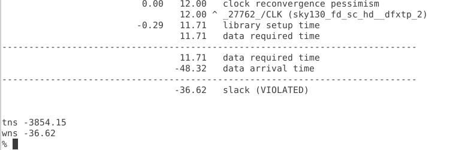

The hold slack is 0.24 and is not in violation.

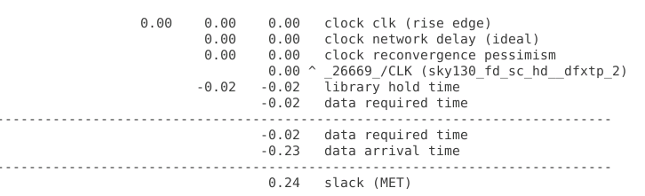

### Timing Violation Reduction

The input capacitance of the `sky130_fd_sc_hd__inv_8` is 17.65 pF and this value is used in the `my_base.sdc` file for the load capacitance (SYNTH_CAP_LOAD). This value should be verified when trying to reduce timing violations.

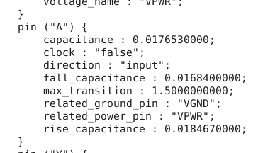

Synthesis values can be changed interactively using the set command instead of modifying the my_base.sdc file. Some examples are shown below.

```
set ::env(SYNTH_DRIVING_CELL) sky130_fd_sc_hd__inv.8
set ::env(SYNTH_DRIVING_CELL_PIN) Y
set ::env(SYNTH_CAP_LOAD) 17.6
set ::env(SYNTH_MAX_FANOUT) 4
```
The fan out can be reduced to reduce the slack. `echo $::env(SYNTH_MAX_FANOUT)` shows that the fanout is set 6. `set ::env(SYNTH_MAX_FANOUT) 4` was used to set the fan out to 4.

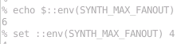

Reducing the fan out did not reduce the slack. Further, work will be need to reduce the slack so that is zero or positive.

### Floorplan

`run_floorplan` failed due not finding a source file.

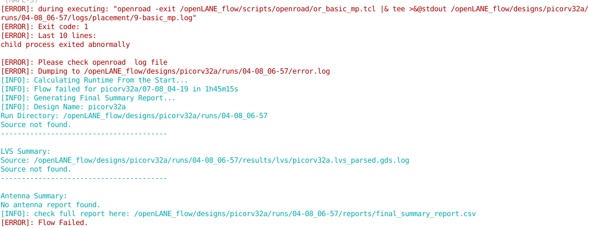

The following procedure was used to manually create a floorplan.

```
init_floorplan
place_io
global_placement_or
detailed_placement
tap_decap_or
detailed_placement
gen_pdn
run_routing
```
`init_floorplan`
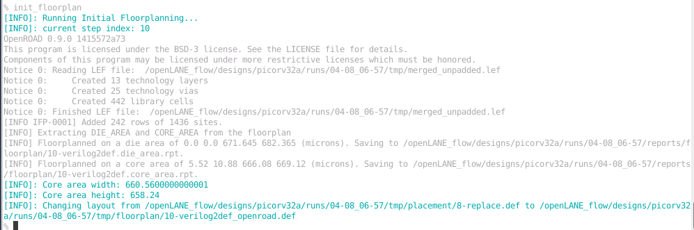
`place_io`
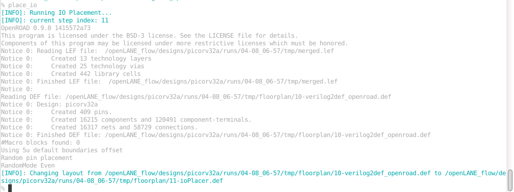

`global_placement_or`
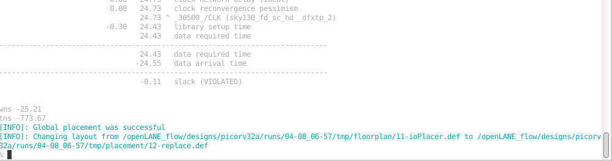

`detailed_placement`
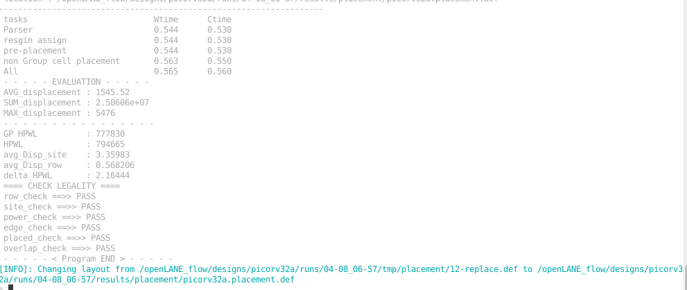

`tap_decap_or`
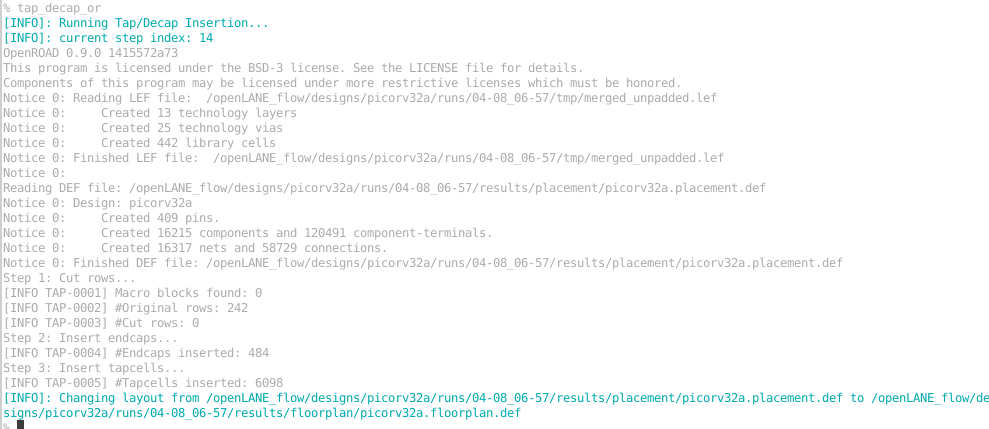

`detailed_placement`
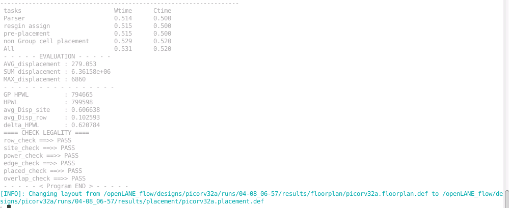

`gen_pdn`
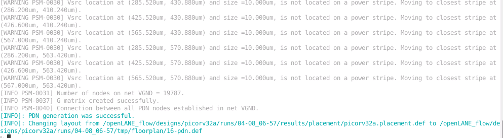

### Magic

Magic was used to view the placement of the design using the command below.
```
magic -d XR -T /home/p-brane/Desktop/work/tools/openlane_working_dir/pdks/sky130A/libs.tech/magic/sky130A.tech lef read /home/p-brane/Desktop/work/tools/openlane_working_dir/openlane/designs/picorv32a/runs/04-08_06-57/tmp/merged.lef def read /home/p-brane/Desktop/work/tools/openlane_working_dir/openlane/designs/picorv32a/runs/04-08_06-57/results/placement/picorv32a.placement.def&
```
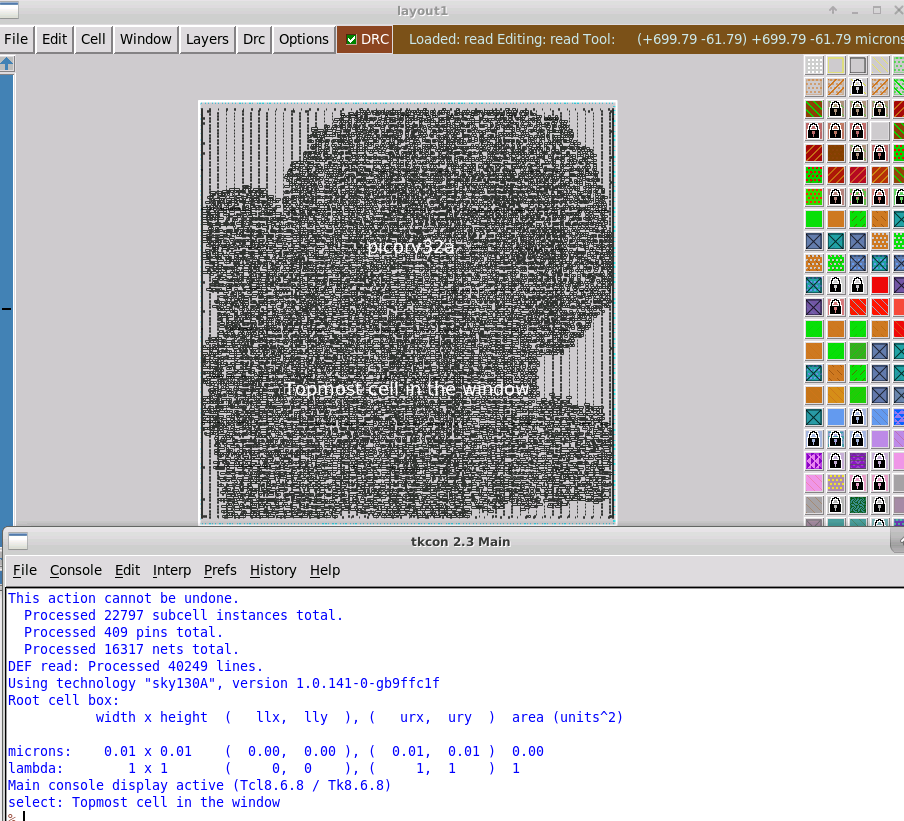

Finding the `skay130_jayinv ` cell turn out to be more difficult that I expected. Using the `s` I selected it and used `what` to lean more about it. `expand` was used to show the layout of the cell!

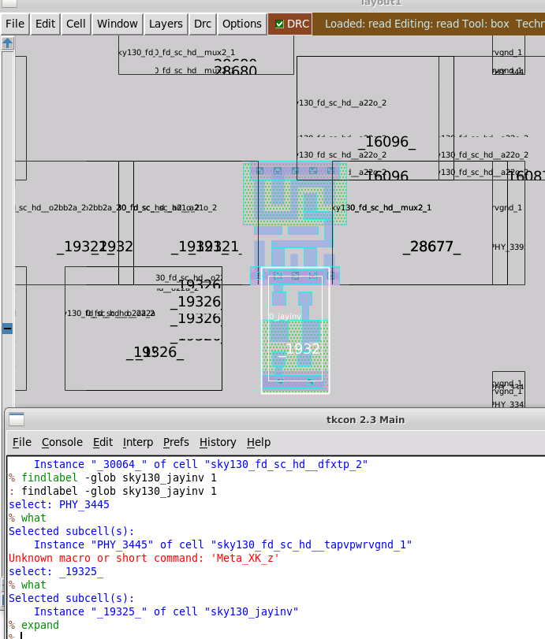

## Day 5

### Power Distribution Network (PDN)

The placement passed all legality checks. Then the `gen_pdn` command was used to generate the PDN.

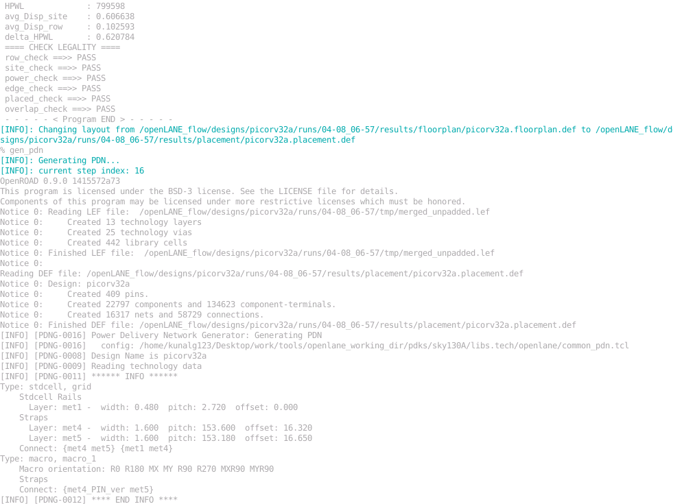

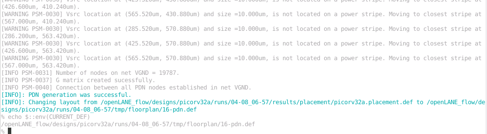

### Routing

The `run_routing` command was used to generate the routing using the default settings. The routing completed with thee violations after running for 17.5 minutes.

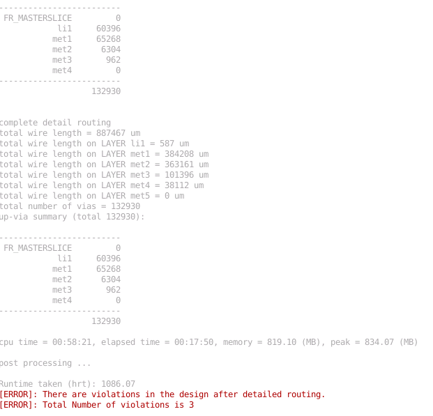

The `20-tritonRouting.drc` log file can be found at `/home/p-brane/Desktop/work/tools/openlane_working_dir/openlane/designs/picorv32a/runs/04-08_06-57/reports/routing/` and shows the DRC violations. These are shown below.

```
violation type: Short
  srcs: frFakeVSS _05946_
  bbox = ( 559.19, 470.32 ) - ( 559.33, 470.8 ) on Layer met1
violation type: Short
  srcs: VGND _05946_
  bbox = ( 559.19, 470.32 ) - ( 559.33, 470.8 ) on Layer met1
violation type: Short
  srcs: VGND _05657_
  bbox = ( 559.98, 470.32 ) - ( 560.12, 470.8 ) on Layer met2
```

### Magic

The following command was used to plot the routing in Magic.

```
magic -d XR -T /home/p-brane/Desktop/work/tools/openlane_working_dir/pdks/sky130A/libs.tech/magic/sky130A.tech lef read /home/p-brane/Desktop/work/tools/openlane_working_dir/openlane/designs/picorv32a/runs/04-08_06-57/tmp/merged.lef def read /home/p-brane/Desktop/work/tools/openlane_working_dir/openlane/designs/picorv32a/runs/04-08_06-57/results/routing/picorv32a.def&
```

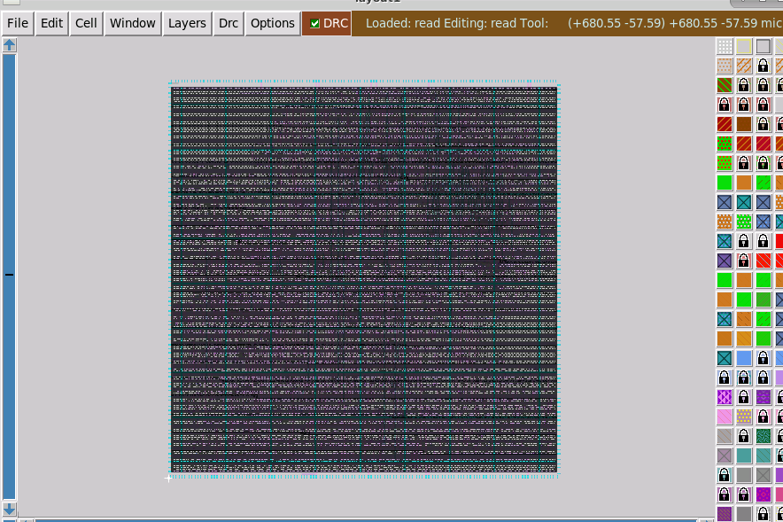

`sky130_fd_sc_hd__buf_1` was selected and expanded to better show the routing.

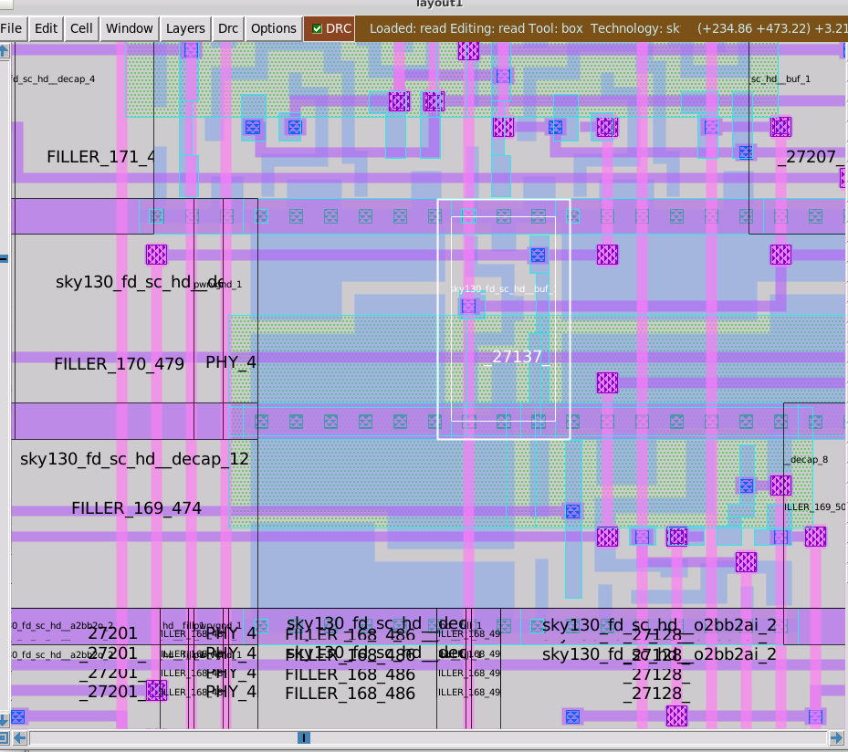
