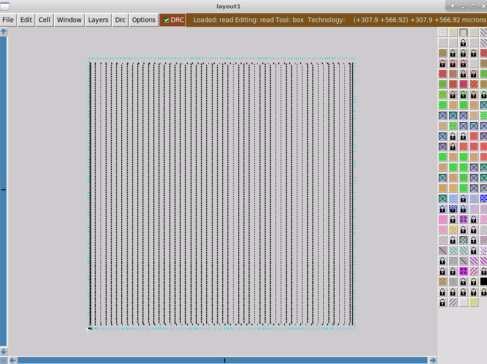

# sky130-apd-workshop

Results for Jay Morreale for the VSD Advanced Physical Design Course held Aug 2-6.

## Day 1

The flowing sequence is the is used to run an interactive OpenLANE flow to synthesis the picorv32a design.

```
cd ~/Desktop/work/tools/openlane_working_dir/openlane
docker
./flow.tcl -interactive
package require openlane 0.9
prep -design picorv32a
run_synthesis
```
The figure below shows the first step.

* 
* 
* 

The Flop ratio from 1-yosys_4.stat.rpt is 1613/14876=0.1084

The buffer (buf1) ratio is 1656/14876=0.1113

## Day 2

### Floorplan Generation
The next step is to create a floorplan for the picorv32a design.

`run_floorplan`

The details of the configuration variable are located in '/home/p-brane/Desktop/work/tools/openlane_working_dir/openlane/configuration/README.md‌‌' under the Floorplanning section. Each variable is shown, defined and a default value is defined. Some of the floorplanning variable are shown in the figure below.


The default values can be change in the floorplan.tcl file. Some of the floorplan.tcl is shown in the figure below.


The floorplan.tch file places the horizontal metal on layer 3 which is metal4 and the vertical metal on layer 4 which is metal5. The metal layer stack is shown in the figure below.


The run_floorplan runs for a while and indicate a successful completion.


The log file ioPlaer.log from the floorplan are found at `/home/p-brane/Desktop/work/tools/openlane_working_dir/openlane/designs/picorv32a/runs/03-08_02-33/logs/floorplan/`


The ioPlacer.log file contains the following info.

```
‌‌OpenROAD 0.9.0 1415572a73
This program is licensed under the BSD-3 license. See the LICENSE file for details.
Components of this program may be licensed under more restrictive licenses which must be honored.
Notice 0: Reading LEF file:  /openLANE_flow/designs/picorv32a/runs/03-08_02-33/tmp/merged.lef
Notice 0:     Created 13 technology layers
Notice 0:     Created 25 technology vias
Notice 0:     Created 440 library cells
Notice 0: Finished LEF file:  /openLANE_flow/designs/picorv32a/runs/03-08_02-33/tmp/merged.lef
Notice 0:
Reading DEF file: /openLANE_flow/designs/picorv32a/runs/03-08_02-33/tmp/floorplan/3-verilog2def_openroad.def
Notice 0: Design: picorv32a
Notice 0:     Created 409 pins.
Notice 0:     Created 14876 components and 115597 component-terminals.
Notice 0:     Created 14978 nets and 56051 connections.
Notice 0: Finished DEF file: /openLANE_flow/designs/picorv32a/runs/03-08_02-33/tmp/floorplan/3-verilog2def_openroad.def
#Macro blocks found: 0
Using 5u default boundaries offset
Random pin placement
RandomMode Even
```

The default config.tcl and default sky130A_sky130_fd_sc_hd_config.tcl file were used for this floorplan run. The configuration files are located at `/home/p-brane/Desktop/work/tools/openlane_working_dir/openlane/designs/picorv32a/`


The picov32a.def file contains the floorplan results and is located at `/home/p-brane/Desktop/work/tools/openlane_working_dir/openlane/designs/picorv32a/runs/03-08_06-01/results/floorplan/`. The total die area is 660685 by 671405 units and can be converter to microns by dividing 1000 (1 micron = 1000 units).


### Floorplan Layout with Magic

Magic will display the floorplan layout graphically. Magic is invoked as using the following command in a new terminal.

`magic -T /home/p-brane/Desktop/work/tools/openlane_working_dir/pdks/sky130A/libs.tech/magic/sky130A.tech lef read /home/p-brane/Desktop/work/tools/openlane_working_dir/openlane/designs/picorv32a/runs/03-08_06-01/tmp/merged.lef def read /home/p-brane/Desktop/work/tools/openlane_working_dir/openlane/designs/picorv32a/runs/03-08_06-01/results/floorplan/picov32a.floorplan.def &`

The sky130A.tech file describes the Skywater 130 nm process and the picov32a.floorplan.def file contain the floorplan for the picorv32a design generated by the run_floorplan script.


The Layout appears.



To zoom, left mouse click and then right mouse click to form a rectangle and press `z` to zoom. Hover over a cell and press 's' to select and the tkcon window will show the status of the cell. The standard cells are located in the lower left corner.


An error occurred so run_synthesis and run_placement error run again.


The magic command becomes

`magic -T /home/p-brane/Desktop/work/tools/openlane_working_dir/pdks/sky130A/libs.tech/magic/sky130A.tech lef read /home/p-brane/Desktop/work/tools/openlane_working_dir/openlane/designs/picorv32a/runs/04-08_06-57/tmp/merged.lef def read /home/p-brane/Desktop/work/tools/openlane_working_dir/openlane/designs/picorv32a/runs/04-08_06-57j/results/floorplan/picov32a.floorplan.def &`

Magic now shows the status of the standard cells, there may still be an error.


## Placement

To place the standard cells run 'run_placement'.


## Day 3

## Day 4

## Day 5
